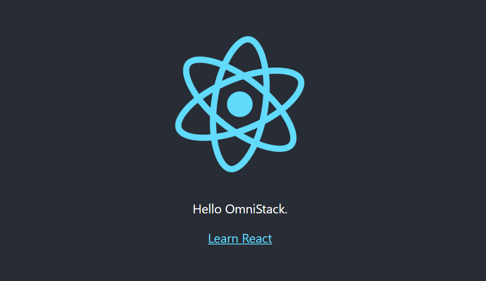

# Semana OmniStack 11.0

## Aplicação desenvolvida: Be the Hero

#### Tecnologias abordadas:
* Stack:
    * Node.js
    * React.js
    * React Native

* Vantagens:
    * Javascript como única linguagem no desenvolvimento Front-end, Back-end e Mobile.
    * Uma stack poderosa completa.
    * O que o mercado está procurando.
    * A quantidade de vagas no mercado de trabalho.
    * O quanto essas tecnologias estão alinhadas com seus objetivos.

#### Ambiente de desenvolvimento:
- [x] Node.js & NPM (LTS).
- [x] Visual Studio Code.

#### Anotações:
1 - Dia.
* Apresentar aplicação.
    * Be the Hero
        * Uma aplicação para cadastro de ONG's.
        * Conectar pessoas que querem ajudar e ONG's.
        * Aplicação Web:
            * Tela de login.
            * Tela de casos cadastrados.
            * Tela de cadastro de casos.
        * Aplicativo Mobile:
            * Tela de login.
            * Tela de casos cadastrados com função de entrar em contato.

* Configurar ambiente de desenvolvimento.
    - [x] Node.js & NPM.
        * Recomenda-se usar a versão LTS.
        * Instalar com gerenciador de pacotes facilita atualizar o Node.
            * Windows: Chocolatey
            * MacOS: Hombrew
            * Linux: depende da distribuição.

    - [x] Visual Studio Code.
        * Dracula Theme.
        * Material Icon Theme.

* Entender sobre Back-end & Front-end.
    * Back-end: 
        * Regras de negócio;
        * Conexão com banco de dados;
        * Envio de e-mail;
        * Comunicação com webservices;
        * Autenticação do usuário;
        * Criptografia e segurança;
        * API RESTfull - métodos, tipo de parâmetros.
            * A comunicação é transmitida em JSON para o Front-end web, Front-end mobile e serviços externos.

* Criar projeto com Node.js.
    - [x] Hello, world.
    
    * NPM:
        * express

* Entender sobre React & SPA.
    * Front-end:
        * HTML, CSS e Javascript da interface do usuário.
        * Apresenta ao cliente as informações requisitadas.

    * Abordagem tradicional:
        * Na abordagem tradicional, a cada requisição, o servidor retorna o conteúdo completo da página, contendo todo HTML e CSS.
        * Essa abordagem limita o front-end para o browser já que o aplicativo mobile ou serviços externos não vão conseguir interpretar o HTML.

    * Abordagem SPA (Single-Page Applications):
        * Na abordagem de SPA, as requisições trazem apenas dados como respostas e com esses dados, o front-end pode preencher as informações em tela.
        * A página nunca recarrega, otimizando a performance e dando vida ao conceito de SPA. Retornando apenas JSON podemos ter quantos front-ends quisermos.

* Criar projeto com React.js.
    - [x] Hello, world.
    
    * NPX:
        create-react-app

* Entender sobre React Native & Expo.
    * Abordagem tradicional:
        * Na abordagem tradicional, criamos uma aplicação para iOS e outra para Android, e nesses casos, o trabalho se torna repetido tanto para criação quanto para as alterações no projeto.
        * Trabalho dobrado para criação e alterações.
        * Tinha que criar o aplicativo movel em linguagem nativa.
            * Objective-C / Swift -> .ipa
            * Java / Kotlin -> .apk
    
    * Abordagem do React Native:
        * Todo código feito é em Javascript, esse código não é convertido em código nativo, melhor do que isso, o dispositivo passa a entender o código Javascript e a interface gerada é totalmente nativa.
        * A mesma aplicação consegue ser gerada para iOS e Android, possibilitando ainda ter flexibilidade de features específicas para cada plataforma.

    * Expo:
        * Sem o Expo, precisamos instalar em nosso sistema tanto o Android Studio para obter a SDK de desenvolvimento Android, e o Xcode (apenas no Mac) para obter a SDK do iOS.
        * Nesse caso, nossa iniciação no desenvolvimento fica mais penosa, já que essas SDK's não são extremamente simples de instalar e livres de erros.
        * Com o Expo, nós instalamos um aplicativo no celular chamado Expo, e dentro dele, tudo o que precisamos para desenvolver no React Native já está instalado, como as API's de mapas, geolocalização, câmera, sensores, calendário, etc...
        * Com isso, não precisamos nos preocupar em gerar o aplicativo para Android e iOS já que o app do Expo instalado tem tudo o que precisamos e assim usamos apenas React.

2 - Dia - Criando a base da aplicação.
* Criar a base da aplicação com Node.js.
    * Node.js & Express
        * Rotas e recursos
        * Métodos HTTP
            * GET: Buscar / listar uma informação no back-end
            * POST: Criar uma informação no back-end
            * PUT: Alterar uma informação no back-end
            * DELETE: Deletar uma informação no back-end
        * Tipos de parâmetros
            * Query Params: (request.query) Parâmetros nomeados enviados na rota após "?", servem para filtros, paginação e podem ser adicionados com "&"
            * Route Params: (request.params) Parâmetros utilizados para identificar recursos, após a "/", acessador na nota como "/:id", servem para identificar um único recurso
            * Request Body: (request.body) Parâmetros do corpo da requisição, utiliado para criar ou alterar recursos, e-mail, nome...

    * Configuração Nodemon
    * Utilizando o Insomnia
    * Diferenças entre bancos de dados
        * SQL: MySQL, SQLite, PostgreSQL, Oracle, Microsoft SQL Server
        * NoSQL: MongoDB, CouchDB, etc.
        * Driver do banco de dados: SELECT * FROM users
        * Query Builder: table('users').select('*').where()
        
    * Configurando bancos de dados
    * Pensando nas entidades e funcionalidades
        * Entidades:
            * ONG
            * Casos (incident)
        * Funcionalidades:
            * Login de ONG
            * Cadastro de ONG
            * Logout de ONG
            * Cadastro de novos cados
            * Deletar casos
            * Listar casos específicos de uma ONG
            * Listar todos os casos
            * Entrar em contato com a ONG
        * Criação de tabelas através de migrations com o Knex:
            * migrations são como um controle de versão do banco de dados.
            * elas facilitam o trabalho onde mais de um developer estão trabalhando.
    * Construção do Back-end
    * Adicionando módulo CORS
    * Enviando back-end ao GitHub

